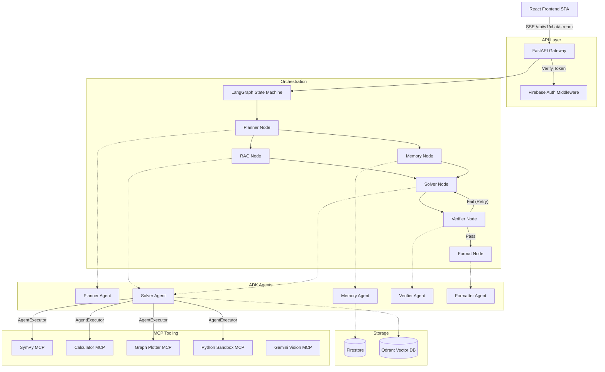

# Architecture Overview

## The Advanced Mathematics AI Agent Platform

This project implements a multi-agent orchestration architecture using **LangGraph**, the **Google ADK (Agent Development Kit)**, and the **Model Context Protocol (MCP)**.

### Core Stack
- **Frontend**: React 19 + Vite + TypeScript (SPA)
- **Backend**: FastAPI + Python 3
- **LLM**: Google Gemini (`gemini-2.5-flash`)
- **Database**: Firestore (Chat history) + Qdrant (Vector database for RAG context)
- **Deployment**: Google Cloud Run + Firebase Hosting

---

## 1. System Architecture Diagram

## 2. Component Descriptions

### The Orchestrator (LangGraph)
The core of the system is a StateGraph (`MathAgentState`) that coordinates a sequence of steps. LangGraph ensures that nodes like RAG retrieval and Memory fetching happen in parallel, while the `SolverNode` waits for their output before generating a solution.

### ADK Multi-Agent System
Instead of one monolithic prompt, the system breaks reasoning into 5 specialized agents:
- **Planner**: Classifies the query (e.g. algebraic vs calculus vs theory).
- **Memory**: Identifies student's weak topics to adjust teaching style.
- **Solver**: The core reasoning engine.
- **Verifier**: Evaluates the Solver's output. If it detects a hallucination, it forces the Solver to retry (up to 3 times).
- **Formatter**: Adds LaTeX styling and pedagogical encouragement.

### MCP (Model Context Protocol) Integration
The `SolverAgent` uses LangChain's `AgentExecutor` to interface with 6 independently sandboxed tools via the MCP protocol. 
This allows the agent to execute inline Python securely, plot mathematical SVG graphs, parse PDFs, and solve complex algebra accurately using SymPy instead of hallucinating raw LLM math.
